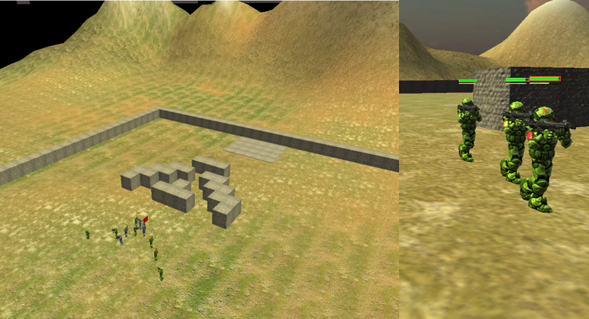

============
Usage Manual
============

Introduction
------------

pyGOMAS (Game-Oriented Multi-Agent System based on Python) is a gaming
simulation platform which combines a Multi-Agent System (MAS) and a
render engine to program Artificial Intelligence (AI) strategies in
the context of well-known games such as Capture the Flag. In a typical
pyGOMAS game, two different teams compete to achieve some goal (e.g.,
capture the flag), with each team being formed by several cooperative
AI agents. Agents’ strategies are mainly coded in AgentSpeak language,
which is based on the BDI (Belief-Desire-Intention) paradigm. In
addition, the pyGOMAS render engine allows spectators to watch the
evolution of the game live, as well as to replay a finished game, in
different modes (both 2D and 3D).

pyGOMAS runs on top of the SPADE MAS platform extended with the BDI
plug-in (SPADE-BDI). SPADE is a MAS platform whose primary purpose is
to provide a flexible, simple, and open agent execution framework. The
two main characteristics of the SPADE platform are the extensive and
strategic use of the XMPP standard and its agent model. XMPP is a
well-known standard for instant messaging and presence notification,
and it is the core of the transport layer which allows agents to
interact with each other in different ways (send and receive messages,
inform each other about their presence status, etc.). On the other hand,
SPADE’s agent model is based on behaviors, which are running patterns
encapsulating the agent’s actions. The code of each agent can be
distributed in one or several behaviors, depending on the way its
actions should be executed. And so, there are behaviors for running
actions just once, cyclically (in an endless loop), periodically
(every time a pre-defined period is reached), after a timeout, or in a
complex pattern following a finite-state-machine configuration. Actions
inside these behaviors are normally coded in Python, which is the
reference programming language for SPADE.

However, pyGOMAS uses the SPADE-BDI extension, which offers agents an
additional, BDI-like behavior which is coded in AgentSpeak language.
For the sake of simplicity, in pyGOMAS the programming of each agent
will be restricted to this BDI behavior only, and so, the agent’s
strategy to win the game will be programmed in AgentSpeak. But, as
explained later, this code can also be extended by invoking custom
actions programmed in Python, for further functionality or convenience.

Capture the Flag
----------------
In pyGOMAS, the classic game of Capture the Flag takes on a new twist
within a World War II setting, with only one flag defended by one of the
opposing teams - the Allies or the Axis powers. The objective remains
straightforward: the assaulting team aims to breach enemy lines and capture
the flag, while the defending team strives to protect it. However, in pyGOMAS,
there's a time limit; if the assaulting team fails to capture the flag
within this period, the defending team secures victory.

Set against the backdrop of the WWII theater, pyGOMAS offers players an
immersive simulation environment where strategic decisions can alter the
course of history. As members of either the Allied or Axis forces, AI agents
must employ tactical strategies and teamwork to outmaneuver opponents.
The game emphasizes swift and decisive action, blending historical significance
with intense competition as agents navigate the battlefield, utilizing
coordinated assaults and defensive tactics to achieve their objectives.
With each match, pyGOMAS plunges players into the heart of wartime conflict,
where victory hinges on skillful maneuvering and strategic prowess.

To clarify the rest of the manual, some basic definitions are now presented:

* **Agent**. A BDI-like software agent autonomously playing the Capture-the-Flag game, according to its own goals and the goals of its team. Agents can interact with the environment (battlefield) by means of perceptions and actions, and they can communicate and coordinate with the rest of the agents in their own team. pyGOMAS incorporates three basic types of agents for each team: Soldier, Medic and FieldOps. New types of agents can also be created if necessary, according to the team’s strategy.
* **System Agent**. An internal, SPADE agent provided by pyGOMAS to support the execution of the game. System agents are totally independent of, and do not affect in any way, the strategy of the playing agents. The system agents’ code is off limits and cannot be modified.
* **Team**. A group of playing agents with a common goal of either capturing (Allies) or defending (Axis) the flag. A team can lose members while playing the game since agents can be killed in action if shot by other agents (belonging to the opposite team, or to their own).
* **Match**. A time-controlled contest in which two teams (Allies and Axis) compete in the Capture- the-Flag game. In each match, one of the two teams always wins: if the Allies team can capture the flag and carry it to their base within the established maximum time, they win the match. Otherwise, the Axis team wins.
* **Pack**. A token present in the environment (battlefield) which can be picked up by a playing agent if the agent passes exactly over the pack’s location. There are three types of packs: the flag, medic packs and ammo packs.
* **Player**. A person, or group of persons, which programs the strategy of a team of agents playing in pyGOMAS. Normally, a player will develop the agents’ code for both teams (Allies and Axis) since the competition against any other player usually involves playing one match as Allies and another one as Axis. The player must provide the code of their agents in advance of a match. Once the match is started, the agents play in a totally autonomous way, with no interaction of any kind with the player.
* **Spectator**. A person watching a live (or already played) match through the render engine of pyGOMAS.

So, the purpose of pyGOMAS is to provide a simulated battlefield where two
teams of agents (Allies and Axis) face each other in a simplified version
of the Capture the Flag game, where there is only one flag to capture and a
limited time to do so. The strategies of both teams can be developed by a
single player or by two different players. In the latter case, pyGOMAS offers
an engaging competition platform for developing agent strategies.

Agents in pyGOMAS
-----------------
This section describes first the predefined types of agents provided by pyGOMAS
(both system agents and regular, playing agents). Then, it discusses the possibility
of creating new types to better support the strategy designed by a player, if necessary.

The pyGOMAS incorporates three types of system agents which globally support the game on
top of the functionality of the SPADE platform:

* **Manager**. This is the system agent which controls the main aspects of the game, including the interactions between the playing agents and the environment (battlefield) and the interface with the render engine (viewer). As explained below, the manager can interact with different types of render engines, both 2D and 3D.

* **Service**. The purpose of this system agent is to offer a yellow pages service to the playing agents. The yellow pages inform about the catalogue of services provided by each agent to its fellow agents in the team. There are some predefined registered services for each agent, and every agent may register new, ad-hoc services, specific to its strategy and role in the team. When an agent dies, the Service agent automatically removes all its services (predefined or otherwise) from the catalogue.

* **Pack**. Packs are modeled as system agents which have a location in the environment, and they can interact with the playing agents. There are three types of pack (system) agents: medic packs, which add health to agents when picked up; ammo packs, which add ammunition to agents when picked up; and objective packs, which represent the goal of the game (in this case, the flag). During the game, medic and ammo packs can be dynamically created and dropped on the battlefield for agents to pick them up, and they can also be destroyed. However, there is only one flag which exists throughout the game, and it cannot be destroyed.

Regarding the playing agents, pyGOMAS offers three basic “troop” agent types to both teams, each of
which with a particular role within the team. In terms of code, the following three agent classes
inherit from a SPADE agent class named BDITroop:

* **Soldier**. This is the most basic troop agent role, providing a service called “backup” to its teammates. This service implements the strategy of helping the rest of teammates to fulfill the team’s goal (either capture or defend the flag). Typical actions of this role include coordinate with fellow troop agents and shoot the enemy troops. The soldier's shots are more damaging than those of the other roles.

* **Medic**. Agents playing this role provide a service called “medic” and they can produce medic packs. Such packs can cure (increase the health level of) the troop agents which pick them up.

* **FieldOps**. Agents playing this role provide a service called “ammo” and they can produce ammo packs. Such packs can increase the amount of ammo available on the troop agents which pick them up.

As mentioned above, the code of such troop agents is developed by following the BDI paradigm and programmed
in AgentSpeak language. pyGOMAS provides a very basic code for each of them, as a sample of how to program
a trivial strategy involving the three types of agents. Players can use this sample code as a starting point
to implement more sophisticated schemes to win the game.
In addition, pyGOMAS also allows players to incorporate new types of playing (troop) agents to their
teams, in case of strategies that would need other, specialized roles. For example, a team may
divide its troop agents in different platoons, each one commanded by an officer agent (lieutenant),
to deploy a complex battle strategy. In turn, such lieutenants could be coordinated by a captain
agent, and so on.

The pyGOMAS Architecture
------------------------
In general terms, pyGOMAS is internally structured in two separate subsystems:
a SPADE application with several agents running on top of it, which is responsible
for controlling and playing the game; and a viewer or render engine, which is
responsible for displaying the evolution of the game on the battlefield during a
match (or later). This architecture is shown in Figure 1.

   Figure 1: The pyGOMAS architecture.

Both subsystems are communicated by means of a well-defined set of messages. In particular,
the Manager agent in the SPADE subsystem sends all the relevant movements of agents in the
battlefield to the engine, which in turn, displays them.

The design decision of separating these two subsystems was made for three main reasons. Firstly,
because the render, as a typical graphical application, may produce heavy computational costs
for some (typically short) periods of time, which could potentially affect the SPADE subsystem.
Secondly, because it facilitates the development of alternative render engines. And thirdly
because this separation allows both subsystems to run independently. In a typical execution layout,
both subsystems are run, and spectators can watch the game live. But a match can also be played
without a render engine, in which case the movement information generated by the Manager agent is
stored as a log file. In this “blind” mode, only the result (the winning team) is shown at the end
of the match. Conversely, a render engine can be executed stand-alone to “replay” a previously
played game, simply by being provided with the corresponding log file of the match.

As explained in the previous section, inside the SPADE subsystem there are four classes of SPADE
agents: Pack, Manager, Service and BDITroop, with this latter specialized in the three initial types
of troop agents available for each team (Soldier, Medic and FieldOps). Regarding the render engine
subsystem, there are currently three different render engines available in pyGOMAS. From the simplest
to the most sophisticated, the first one would be the text engine, which displays the battlefield and
the evolution of the game in a text console. Figure 2 shows this engine for an ongoing match. In this
visualization, the Allies and Axis bases are depicted as a red and blue big box, respectively.
Accordingly, Allies and Axis soldiers are represented by asterisks with blue or red background, while
the flag is shown as an “F” with yellow background. As can be seen in the figure, the battlefield also
features some obstacles which soldiers cannot go through, as it will be explained later.

   Figure 2: The text-based render engine of pyGOMAS.

The next render engine is based on Python’s Pygame library and has a similar 2D representation featuring a
zenithal view, but with greater precision and much more detail. This engine, shown in Figure 3 also depicts
the base of both teams as big boxes (red or blue). The position of each agent in the battlefield is here
enhanced with other information as the soldier’s name or its “vision cone”, depicting exactly the part of
the battlefield the soldier can perceive at each moment.

   Figure 3: The render engine of pyGOMAS.

Finally, pyGOMAS also includes a 3D render engine based on Unity, in which the spectator can change the
point of view and soldiers are depicted as humanoids. Figure 4 presents two pictures of this engine during
a match. In the left side, there is an aerial view of the battlefield, while the right side presents a much
closer view of three advancing soldiers. In this latter picture, it can be seen that the Unity engine
increases the amount of data displayed during the match, including for example the current amount of health
and ammo of each soldier, which are represented as bars above the soldier.

   Figure 4: The 3D render engine of pyGOMAS.

Files involved in a pyGOMAS match
---------------------------------
Each match in pyGOMAS requires some specific files, which are described in this section.
They are mainly related to the description of the battlefield and the agents involved in
the match, and the strategies implemented for such agents. The next subsections describe
these files.

Map files
~~~~~~~~~

The environment where the troop agents play (i.e., the battlefield) is described in some
“map” files, describing the shape and size of the battlefield, the internal walls or obstacles
inside it, and some configuration parameters relevant to the playing agents and the render engine.

Each match is played in a particular map, among the ones available. In particular, map files are
stored in a folder called maps in the distribution folder. In the maps folder, each map has its
own subfolder called map_XX, with XX being the map number.

Inside the folder of a particular map (e.g., map_04), there are two files:

1. ``map_04_cost.txt``. This file contains a text representation of the shape of the environment. This includes the external walls (boundaries) of the map and may also include some internal walls or obstacles (solid objects that the troop agents cannot go through). The bitmap uses the character ‘*’ to indicate a solid wall. The following is an example of the contents of this file:

::

********************************
*                              *
*                              *
*                              *
*                              *
*                              *
*                              *
*                              *
*                              *
*                              *
*                              *
*                              *
*                              *
*                              *
*                              *
*                              *
*                              *
*                              *
*                              *
*                         **  **
*                         *    *
*               *         *    *
*               *         *    *
*               *         *    *
*             ********   **    *
*             *      *****     *
*             *          *     *
*   ***  ******          *     *
*             *                *
*                              *
*                        *     *
********************************

2. ``map_04.txt``: This file contains the values of some configuration parameters which are relevant to either the playing agents or the render engine, and which complements the information of the previous file. The configuration parameters included in this file are:

* ``pGOMAS_OBJECTIVE``: initial coordinates of the flag.
* ``pGOMAS_SPAWN_ALLIED``: coordinates of the Allies base.
* ``pGOMAS_SPAWN_AXIS``: coordinates of the AXIS base.
* ``pGOMAS_COST_MAP``: size and filename of the cost file.

The following is an example of the contents of this file:

::

    [pGOMAS]
     pGOMAS_OBJECTIVE: 28 28
     pGOMAS_SPAWN_ALLIED: 2 28 4 30
     pGOMAS_SPAWN_AXIS: 20 28 22 30
     pGOMAS_COST_MAP: 32 32 map_04_cost.txt
    [pGOMAS]

In the virtual environment, the position of an agent (a troop, a pack, etc.)
or a fixed element (a wall) is expressed in (x, y, z) coordinates, but in all
maps, the “y” component (height) is always 0. So, in the file described before,
the position of the flag is a (28, 0, 28), and the position for the Axis base
is a square from coordinate (20, 0, 28) to coordinate (22, 0, 30).
Finally, the size of the map expressed in the ``pGOMAS_COST_MAP`` option indicates
that the map size will be 32 x 32, corresponding to the shape of the map depicted
in the ``map_04_cost.txt`` file.

Agent description file
~~~~~~~~~~~~~~~~~~~~~~

The description of the agents playing a particular match is contained in a JSON
file which can be freely named, since it is specified in the command line when
pyGOMAS is instructed to start a match. For example, let us suppose that the file
is named myagents.json.

The typical content of this description or configuration file would be:

::

    {
        "host": "xmpp.server.address",
        "manager": "manager_mylogin",
        "service": "service_mylogin",
        "axis": [
            {
                "rank": "BDIMedic",
                "name": "medic_axis_mylogin",
                "password": "secret",
                "amount": 3
            }
        ],
        "allied": [
            {
                "rank": "BDISoldier",
                "name": "soldier_allied_mylogin",
                "password": "secret",
                "amount": 3
            }
        ]
    }

Where:

* ``host`` is the DNS name of the XMPP server running the SPADE agents (please remember to change xmpp.server.address with the actual address of your XMPP server).
* ``manager`` is the name of the Manager agent running in SPADE for the match.
* ``service`` is the name of the Service agent running in SPADE for the match.
* ``allied`` contains the list of the troop agents for the Allied team. The elements inside are:
    * ``rank`` is the type of troop of the agent (BDISoldier, BDIMedic, or BDIFieldOps)
    * ``name`` is the name of the corresponding agent in SPADE. SPADE registers this name in the XMPP server, and so, it must be unique within the registered users in the server.
    * ``password`` is the password of the agent in the XMPP server.
    * ``asl`` is an optional parameter that indicates the file containing the AgentSpeak code of the agent.
    * ``amount`` is an optional parameter that indicates the number of troop agents of this type that will be created for the match (all sharing the same AgentSpeak code).
* ``axis`` contains the list of the troop agents for the Axis team. It features the same elements than the allied option before.

So, the configuration file above would create three troop agents (all medic) for
the Axis team, and three troop agents (all soldiers) for the Allied team. The
code of these agents would be expected in the default filenames reserved for each
type of troop, as described in the next section.

Agent Strategy file (asl)
~~~~~~~~~~~~~~~~~~~~~~~~~

Each playing (troop) agent requires a file containing the AgentSpeak (or ASL) code with
its strategy, whose filename can be specified in the “asl” property in the JSON configuration
file described above. These files are placed by default under the ASL folder of the pyGOMAS
distribution.

If the ASL code file of a particular troop agent is not specified in the JSON file, pyGOMAS
assumes the corresponding code is in some default filename. Depending on the type of the troop
agent, such default files are: ``bdisoldier.asl``, ``bdimedic.asl``, and ``bdifieldop.asl``.
pyGOMAS provides the players with some very basic strategy for each type of troop in such default
files, which can be used to directly play a pyGOMAS match right after installing it, or as a
default (poor) strategy to play against, as a player develops more sophisticated behaviors for
the troops. You can check these files in: https://github.com/javipalanca/pygomas/tree/master/pygomas/ASL.

Below the main features of the ASL code in pyGOMAS are explained, including the predefined
beliefs and actions available for the troop agents. An ASL manual compatible with SPADE BDI can
be found in: https://github.com/javipalanca/spade_bdi/blob/master/docs/usage.rst.

Installing pyGOMAS and running a match
--------------------------------------

This section describes, step by step, how to install and run the pyGOMAS environment in your
system. It should work in any recent version of Windows, Linux or MacOS since the software it
is based on can be installed in any of them.

The main steps for installing pyGOMAS are:

1. Install/configure a XMPP server,
2. Install Anaconda,
3. Install pyGOMAS, and
4. Download the Unity render (this is optional).

The next subsections describe each step, and then a final one explains how to run matches in the environment.

Install or use a XMPP server
~~~~~~~~~~~~~~~~~~~~~~~~~~~~

Any installation of pyGOMAS requires the use of the SPADE middleware, which in turn needs a XMPP server.
This may be a standard XMPP server, running independently from pyGOMAS, or a dedicated server for
SPADE/pyGOMAS. This section explains both possibilities.

If you are going to use a XMPP server already installed for any other use, this server must be accessible
through the network from the computer(s) you are going to run the pyGOMAS environment (please check that
all the required ports are not cut by any firewall). In addition, the server needs to have the automatic
registration feature activated.

If you are installing your own XMPP server:

A. For Linux or MacOS systems, the recommended XMPP server is prosody (https://prosody.im). After the installation, you need to turn on the in-band register option in the configuration file prosody.cfg.lua, by setting the following option: ``allow_registration=true``
B. For Windows systems, the recommended XMPP server is openfire (https://www.igniterealtime.org/projects/openfire). In this case, the installation steps are described in the web, and the automatic registration is already activated. During the installation, it is important to set the server’s name as “localhost” and the internal database as the storage system.

Install Anaconda
~~~~~~~~~~~~~~~~

We recommend the use of a virtual environment to install and execute pyGOMAS. In the rest of this manual,
we consider that pyGOMAS is installed in Anaconda environment.

To install Anaconda, you just need to find the download the distribution for your operating system,
from https://www.anaconda.com/download, and follow the installation steps.

Install the pyGOMAS environment
~~~~~~~~~~~~~~~~~~~~~~~~~~~~~~~

The installation of pyGOMAS is performed inside an Anaconda environment with a base of Python version 3.9.
Depending on the system you have:

A. In Windows systems, the steps are the following:
    1) In the Anaconda graphical tool, create a new environment (with Python 3.9).
    2) Once created, open a terminal from the environment and run:
    ::

        $ pip install windows_curses
        $ pip install pygomas

B. In Linux or MacOS systems:
    1) Open a terminal and create a Python 3.9 Anaconda environment:
    ::

       $ conda create -n pygomas python=3.9

    2) Activate the environment:
    ::

      $ conda activate pygomas

    3) Install pyGOMAS:
    ::

        (pygomas)$ pip install pygomas

Donwload the Unity render executables
~~~~~~~~~~~~~~~~~~~~~~~~~~~~~~~~~~~~~

If you want to play a pyGOMAS match and visualize it with the 3D Unity render,
you will need to download it first. There are three executable files, one for
each OS (Windows, Linux and MacOS).

These executable files can be downloaded from the GitHub page of pyGOMAS:

* Windows version: https://github.com/javipalanca/pygomas/releases/download/0.5.0/pygomas-render-v2.0.2.zip
* Linux version: https://github.com/javipalanca/pygomas/releases/download/0.5.0/pygomas-render-v2.0.2.tar.gz
* MacOS version: https://github.com/javipalanca/pygomas/releases/download/0.5.0/pygomas-render-v2.0.2.dmg

Run a pyGOMAS match
~~~~~~~~~~~~~~~~~~~

For convenience, the execution of a match in pyGOMAS must be performed from three different
terminals, all of them running the pyGOMAS Anaconda environment created in the last subsection
(that is, open a terminal, then run: conda activate pygomas). These three terminals will execute
the Manager agent, the troop agents, and the render engine, respectively.
In particular:

1. Run the **Manager Agent**. This agent is executed by running the following:

::

    (pygomas)$ pygomas manager -j <login_manager>@address.xmpp.server -m <map> -sj <login_service>@address.xmpp.server -np <n_agents>

Where:

    * ``address.xmpp.server`` is the name (or IP) of the XMPP server you are using. If using your own local server, it would be localhost (or 127.0.0.1), or the computer name you used when setting the server up.

    * ``<map>`` is the name of the folder containing the map files (inside the maps folder).

    * ``<n_agents>`` is the number of agents playing in the match.

2. Run the **troop agents**. This is performed by running:

::

    (pygomas)$ pygomas run -g <myagents.json>

Where:

* ``<myagents.json>`` is the name of the JSON file containing the description of the playing (troop) agents. Remember that the files that include the ASL code for the agents are specified inside the JSON file (or, otherwise, they are assumed to be, by default, ``bdisoldier.asl``, ``bdimedic.asl``, and ``bdifieldop.asl``).

3. Run the **render engine**. As explained above, there are three alternative render engines you can use to view the match:

    a) Launch the pyGOMAS render:
        ::

            (pygomas)$ pygomas render [--ip <IP_address>] [--port <port_number>] [--maps <path>] [--log <logfile>]

    Where:
        * ``--ip <IP_address>``: Manager's address to connect the render (default value is localhost).
        * ``--port <port_number>``: Manager's port to connect the render (default value is 8001).
        * ``--maps <path>``: The path to your custom maps directory (default is none).
        * ``--log <filename>``: File to save the game (default is ``match.log``).

    b) Launch the **text-mode pyGOMAS render**:
    ::

        (pygomas)$ pygomas render --text

    This option accepts the same arguments as the previous one.

    c) Launch the **Unity render**. In this case, you need to launch the Unity engine and press
    “Play”. Once the battlefield is loaded, you need to specify the IP address and port where
    the Manager agent is listening. If using a local XMPP server, the default configuration is
    correct: 127.0.0.1, port 8001. This option is limited to using the default maps provided with the pyGOMAS distribution.

Developing the Strategy of a Team
---------------------------------
As explained before in this manual, the strategy of a troop agent is specified in AgentSpeak (or ASL)
language, following the BDI paradigm. The ASL code of an agent will contain the beliefs, goals (plans)
and actions that will determine how the agent will respond throughout the game.

As explained below, pyGOMAS has introduced several predefined beliefs for agents to perceive their environment,
and some actions that will allow them to interact with other agents (teammates or enemies). Also, the list of
available actions can be increased since players can add custom actions (written in Python) that are invoked
from the ASL code.

So, from the player’s viewpoint, the programming of an agent’s behavior can use any ASL construct, but the agent’s
interaction with the environment or other agents is limited to the predefined perceptions and actions provided by
pyGOMAS.

The following subsections describe the different aspects relative to the strategy development: the default
behavior set for the troop agents, how to perceive and interact with the environment, how to be aware of who
are the agent’s teammates and to communicate with them, how to add new types of troop agents, and finally how
to add new actions to be called from the ASL code.

Default Troop Behaviors
~~~~~~~~~~~~~~~~~~~~~~~
As explained above, the default team strategy provided by pyGOMAS incorporates three types of troop agents
(soldier, medic and fieldops), each of which providing different services to their fellow teammates in
order to achieve the team’s goal (either capture or defend the flag).

The following is an excerpt of the default ASL code of a **soldier** (in the Allied team):

::

    //TEAM_ALLIED:
    +flag (F): team(100)
      <-
          +exploring;
          .goto(F).

    +flag_taken: team(100)
      <-
        .print("TEAM_ALLIED flag_taken");
        ?base(B);
        +returning;
        .goto(B);
        -exploring.

    +enemies_in_fov(ID,Type,Angle,Distance,Health,Position)
      <-
          .shoot(3,Position).

In this ASL code, there are three plans for the soldier. The first one instructs the soldier
to go to the flag’s location. The second one would be triggered when the soldier has taken
the flag (flag_taken), and in this case, the instructions are to return to the base’s position.

The third one is triggered by the predefined belief enemies_in_fov, which is inserted periodically
by the Manager agent to the agent’s memory. This belief tells the agent about the position of any
enemy which is in the agent’s vision cone, identified by the “ID” parameter. This belief will be
instantiated once for each enemy in the vision cone. The corresponding action in this case is to
shoot 3 times in the direction of the enemy, by means of the predefined action “.shoot”.
These plans and actions are further explained below.
The default behaviors for medic and fieldop troop agents are similar to the one defined for soldiers,
but they also include some private actions such as “.cure” to produce medic packs or “.reload” to produce
ammo packs, respectively.
The full lists of available predefined beliefs and actions are described in the corresponding subsections below.

Perception of the Environment
~~~~~~~~~~~~~~~~~~~~~~~~~~~~~

The way troop agents perceive the environment is by some predefined beliefs that are automatically inserted
by the Manager into the agents’ knowledge bases. These beliefs are periodically updated by the Manager according
to the position and status of every agent in the environment.

The list of the main available beliefs available for troop agents is:

* **team(X)**: X is the value of the agent’s team, which can be 100 (Allied) or 200 (Axis).
* **base([X,Y,Z])**: [X, Y, Z] are the coordinates of the agent’s base.
* **flag([X,Y,Z])**: [X, Y, Z] are the flag’s initial coordinates. This is a static value; it is not updated if the flag is taken and carried by a soldier.
* **health(X)**: X is the health level of the agent. By consulting this value, the agent knows the most updated value of its own health, ranging from 0 to 100.
* **ammo(X)**: X is the ammo level of the agent. By consulting this value, the agent knows the remaining amount of ammo it has, ranging from 0 to 100.
* **position([X,Y,Z])**: [X, Y, Z] is the current position of the agent.
* **enemies_in_fov(ID, TYPE, ANGLE, DIST, HEALTH, [X,Y,Z])**: This belief tells the agent that an enemy is visible in its view cone, along with the characteristics of the spotted enemy: its ID, its TYPE, the ANGLE and DISTANCE the enemy stands relative the position of the agent, the enemy’s remaining HEALTH and its [X, Y, Z] coordinates.
* **friends_in_fov(ID, TYPE, ANGLE, DIST, HEALTH, [X,Y,Z])**: This belief tells the agent that a fellow teammate is visible in its view cone. The set of values is equivalent to the previous belief.
* **packs_in_fov(ID, TYPE, ANGLE, DIST, HEALTH, [X,Y,Z])**: This belief tells the agent that a pack is visible in its view cone. In this case, the TYPE corresponds to 1001 (MEDICPACK), 1002 (AMMOPACK), 1003 (FLAG).

Actions on the Environment
~~~~~~~~~~~~~~~~~~~~~~~~~~

In the same way than the perceptions (beliefs) described above, pyGOMAS provides the troop
agents with some predefined actions to affect the environment, mostly the situation of the
agent itself or the other troops or packs present in the battlefield.

Some of the main actions related to the environment are the following:

* **.goto([X,Y,Z])**: This action establishes the [X,Y,Z] coordinates as the agent’s destination and sets the agent going to that position, by using a JPS algorithm to be able to reach it (this is an optimized version of a path-planning, A* Algorithm). When the agent finally gets to that position, that automatically triggers the belief target_reached.
* **.stop**: Stops the advancing of the troop agent.
* **.look_at([X,Y,Z])**: Orients the troop agent towards position [X,Y,Z].
* **.shoot(N, [X,Y,Z])**: Shoots N shots to position [X,Y,Z].
* **.cure**: Create a medic pack (this is reserved for medic troops).
* **.reload**: Create a ammo pack (this is reserved for fieldop troops).

Actions `.cure` and `.reload` generate a different number of packets depending on an internal
value of the agent (called stamina). This stamina value is consumed each time the agent runs
these actions, and it is replenished periodically (after a given time). This limits the number
of packets which agents can generate and prevents agents from continuously generating packets.

All these actions internally produce communication with the Manager agent in pyGOMAS, which
executes the corresponding actions to the simulated environment and then displays them in the
render engine.

For example, the following plan tells a soldier to go and get a pack when it becomes visible
(if the pack is not the flag):

::

   +packs_in_fov(ID,Type,Angle,Distance,Health,Position): Type < 1003 <-
        .goto(Position);
        +goforpack.

It is important to note that there are no specific actions to pick up a pack (medic, ammo, or
the flag). A troop agent always picks up a pack that happens to be in the same position as the
agent. So, to get a medic or ammo pack, a troop agent just needs to go the pack’s position, and
then it automatically picks it up (and the pack disappears, as it is “consumed” by the agent).
In the same way, to capture the flag a troop agent only needs to go to the flag’s position and
then keep moving (the flag will move with the agent), if it is an Allied agent. If it is an Axis
agent, the flag is automatically sent back to its initial position if the agent reaches it.

The following examples show some default behaviors for troop agents regarding the flag, depending
on the team to which the agent belongs. The first example is a simple two-plan strategy for an
Allied troop agent to capture the flag:

::

    +flag (F): team(100)
      <-
        .goto(F).
    +target_reached(T): team(100)
      <-
        .print("target_reached");
        -target_reached(T).

The first plan is always triggered initially, since the “flag” belief is one of the default ones,
indicating the initial position of the flag in the battlefield. The second plan would be triggered
when the agent gets to the flag’s position and, if so, the agent would be holding the flag. Please
note that the precondition of both plans is the belief team(100), which is true for the Allied team.

The second example is again a two-plan strategy, but in this case for the Axis team, whose strategy
is to go to a fixed position in the map:

::

    +flag(F): team(200) <-
        +tomycorner;
        .goto([20, 0, 20]);
        +myposition([20, 0, 20]).
    +target_reached(T): tomycorner
      <-
       -tomycorner;
       .print("I hold the position: ", T);
       -target_reached(T).

In this case, the first plan is triggered when it receives the flag’s position by means of the flag
belief which is normally the starting activity of any soldier. In this case, the plan has the condition
that the agent must belong to the Axis team (due to the team(200) condition). The actions of the plan
consist mainly of going to the upper left corner (coordinates [20, 0,2 0]). The coordinates are
determined considering that the outer wall has a thickness of 10 points (on the map), so the agent will
get to the corner without colliding with the wall. Then, it saves its position in the belief `myposition([20, 0, 20])`.
The second plan would activate when the agent reaches the desired position (the upper left corner) and
stays in that position.

   Figure 5:  Final position reached by an Axis troop agent.

Agent Awareness and Teamwork
~~~~~~~~~~~~~~~~~~~~~~~~~~~~

Agents can communicate with their teammates and provide services to them, to be able to better coordinate
and produce a common strategy as a team. This is based on a yellow pages service, explained in this section,
and some communication facilities, explained in the next one.

pyGOMAS proposes a yellow pages service for agents to publish the services they provide, which is carried
out by the Service system agent. This service is the way in which any given agent is aware of who its teammates
are (the ones still alive) and which services they are providing. As explained below, one of the basic “services”
provided is the type of troop each agent is (soldier, medic, or fieldop, or any other custom type created by the
player). Another of these basic services is the team to which the agent belongs (“Axis” or “Allied”).

The yellow pages mechanism offers an interface of specific actions to the troop agents, to be invoked from their
respective ASL code. These functions can be broadly categorized in two groups:

A. **Registration** of a service. Whenever a troop agent wants to register a service that it is going to provide
to others, it should invoke the following action:

::

                           .register_service(“service_to”)

Where “service_to” is the name of the service the agent wants to register. This action internally communicates with
the Service system agent, which is the one registering the service in its database.

There are some default services that predefined troop agents register automatically (at initialization time) and
transparently from the ASL code implemented by the players. The following table summarizes the names of these services:

.. table::
   :widths: auto

+---------+-------------+----------------+--------------+-------------+---------------+--------------+
|         |                 **Allied**                  |                  **Axis**                  |
+=========+=============+================+==============+=============+===============+==============+
|         | **Soldier** | **Medic**      | **FieldOps** | **Soldier** | **Medic**     | **FieldOps** |
+---------+-------------+----------------+--------------+-------------+---------------+--------------+
| Service |   allied    | allied         |  allied      |  axis       | axis          |   axis       |
+         +-------------+----------------+--------------+-------------+---------------+--------------+
|         |   backup    | medic          | fieldops     | backup      | medic         | fieldops     |
+---------+-------------+----------------+--------------+-------------+---------------+--------------+

B. Query the agents providing a service. Whenever a troop agent wants to retrieve the list of agents providing
a particular service, it should invoke the following action:

::

                              .get_service(“service_to”)

Where “service_to” is the name of the service the agent wants to know which other agents provide. This action
internally communicates with the Service system agent, which responds indirectly, by inserting a belief of a
certain type into the knowledge base of the querying agent. In particular, the belief is named precisely:
“service_to(L)”, where L is the list of the existing agents providing that service.

Corresponding to the default services mentioned above, agents may use some predefined query actions. The following
table summarizes such actions and the respective beliefs which would be inserted as a response:

.. table::
   :widths: auto

   +--------------------------+-------------------------+-----------------------+--------------------------+
   |                          | **Soldiers in my team** | **Medics in my team** | **FieldOps in my team**  |
   +==========================+=========================+=======================+==========================+
   | **Query action**         | .get_backups            | .get_medics           | .get_fieldops            |
   +--------------------------+-------------------------+-----------------------+--------------------------+
   | **Belief** (response)    | myBackups(BK_list)      | myMedics(M_list)      | myFieldops(FO_list)      |
   +--------------------------+-------------------------+-----------------------+--------------------------+

It is important to note that the returned list of all these beliefs always exclude the agent invoking
the querying action, and that the returned list includes only the agents providing the service which are
still alive in the game.

The usual way in ASL to respond to a belief being inserted in the agent’s knowledge base is to provide a
plan that matches the belief. For example, let’s suppose that a troop agent, in one of its plans, execute
the action .get_medics, and that this agent has the following plan in its code:

::

  +myMedics(M)
   <-
    .println("The list of medics in my team is: ", M);
    .length(M, X);
    if (X==0) {
        .println(“No medics left!!”);
    }.

This plan would be executed when the Service agent “responds” with the list of medics in the
agent’s team. The agent would print the list to the console and calculate its length. If the
list is empty, it would also print “No medics left!!”. Please note that if the agent executing
this plan was itself a medic, its identifier would not be included in the list (and then, the
message should probably be: “No medics left (but me)!!” :-).

This other example will show how to make use of a new service. Let’s suppose two agents, A and B.
Agent A wants to register a new service named “colonel”, and Agent B wants to know who its Colonel
is (and do something about it). In this scenario, Agent A should execute the following action inside
some of its plans:

::

 .register_service(“colonel”)

When Agent B wants to know who the Colonel of the team is, it should execute the action .get_service(“colonel”),
and also have a plan that can be triggered by the response, like the following one:

::

    +colonel(X)
       <-
        .print("My Colonel is:", X);
        -colonel(_).

Another way of processing the returning answer from the Service agent would be to wait for
some time after querying for the Colonel’s identity, and then check for the answer, all in the same plan:

::

    .get_service(“colonel");
    .wait(2000); // wait a reasonable time
    if (colonel(X)) {
        .print("My Colonel is:", X);
        -colonel(_);
    }.

Agent Communication and Coordination
~~~~~~~~~~~~~~~~~~~~~~~~~~~~~~~~~~~~

Agents in the same team may coordinate indirectly, by triggering plans when seeing each other,
which causes the insertion of the belief friends_in_fov explained above in Section 7.2. Or else,
they can coordinate directly, by sending and receiving explicit messages, as it is now explained.

When an agent wants to send a message to another one (or to a list of agents), it may use the following action:

::

    .send(Receiver, Performative, Content)

Where:

* `Receiver` is the identifier of the agent to which the message is sent. It may be a list of identifiers (in which case the message will be broadcast to them).
* `Performative` is the type of message (performative) which gives sense to the message (tell, untell, achieve, etc.). The list of available performatives are the ones defined by the KQML language.
* `Content` is the actual content of the message.

From the viewpoint of the receiving agent (or agents), the message is delivered by inserting the content as
beliefs in their knowledge bases. So, they should have a plan which triggers whenever this type of belief is inserted.

As an example, let’s suppose that a soldier agent (Agent A) has a plan in which it wants all the medics in
its team to get to its own position (to cure the agent, to regroup, etc.). As a part of this plan, Agent A
can send the medics this message:

::

    ...
    ?position(Pos);
    ?myMedics(M); // Action .get_medics is supposed to have been called first
    .send(M, tell, go_to(Pos));
    ...

The first instruction queries the agent’s position and stores it in the Pos variable, and the second
gets the list of available medics in the M variable (the agent is supposed to have previously called
the .get_medics action, to have this information available). Finally, the third one sends all the medics
a message in which it informs them about the content “go_to(Pos)”.

For this message to be correctly received and processed, the medics in A1’s team should have a plan that
gets triggered when this content is “received”, that is, inserted as a belief into their respective
knowledge bases, for example:

::

    +go_to(Pos)[source(A)]
   <-
        .println("Go to message received from: ", A, “ to go to: “, Pos);
        +helping;
        .goto(Pos).

In this case, the medics receiving the message would print the message on the console and then go to
Agent A1’s position.

Adding New Actions
~~~~~~~~~~~~~~~~~~

It is possible to extend the list of available actions that troop agents can invoke from the ASL code,
by developing new, custom actions. Such actions are implemented in Python. The implementation must first
extend the agent class corresponding to the type of troop agent to which the new action should be
available. In the most general case, the class to extend would be BDITroop, but it is more usual to
extend the particular classes (soldier, medic or fieldops).

Let’s say we want to add an action called .newaction to be available to a new type of soldier troop
(NewSoldier). For the sake of simplicity, we will assume that this action will not return any value (the
case for returning values will be discussed afterwards). In this case, a new Python file named Soldier.py
(for example) should be created with the following contents:

.. code-block:: python

    import json
    from pygomas.bdisoldier import BDISoldier
    from ... # Add any other required imports

    class NewSoldier(BDISoldier):
        def add_custom_actions(self, actions):
            super().add_custom_actions(actions)

            @actions.add(".newaction", 0)
            def _newaction(agent, term, intention):
                # Here goes the new action’s code
                yield

The new action will be available for agents which belong to the new type (NewSoldier). So, in this case,
we need to create such agents in the JSON file where the playing agents are defined. So, at least one
agent in the JSON specification file should look like this:

.. code-block:: json

    {
        "rank": "Soldier.NewSoldier",
        "name": "new_soldier",
        "password": "secret",
        "asl": “newsoldier_code.asl”,
        "amount": 1
    }

Where, in the rank option, the new class is specified in format ``<Python_filename>.<class_name>``.
And in the AgentSpeak file referenced by option asl, the code will be able to invoke the
``.newaction`` action, besides all actions available to the regular BDISoldier agent.

Below there is another example featuring an action that makes a fieldops agent move randomly:

.. code-block:: python

    import json
    import random
    ...

    class BDIDrunkenMonkey(BDIFieldOp):

        def add_custom_actions(self, actions): super().add_custom_actions(actions)
            @actions.add(".drunkenMonkey", 0)
            def _drunkenMonkey(agent, term, intention):
                randX = random.randrange(self.map.get_size_x() - 10)
                randZ = random.randrange(self.map.get_size_z() - 10)
                while (self.map.can_walk(randX, randZ) == False):
                    randX = random.randrange(self.map.get_size_x() - 10)
                    randZ = random.randrange(self.map.get_size_z() - 10)
                self.movement.destination.x = randX
                self.movement.destination.z = randZ
                self.bdi.set_belief(DESTINATION, tuple((randX, 0, randZ),))
                yield

On the other hand, if the new action must return a value (that is, a new function is needed),
the steps are very similar as explained above. There is a small difference in the Python code
implementing the function. If we want to introduce a new function that accepts an integer
value and returns another one, the Python code for extending the BDITroop class should look like this:

.. code-block:: python

    import json
    from pygomas.bdisoldier import BDISoldier
    from ... # Add any other required imports

    class NewSoldier(BDISoldier):

        def add_custom_actions(self, actions):
            super().add_custom_actions(actions)

            @actions.add_function(".newfunction", (int,))
            def _newfunction(x):
                # Simply return x^2
                return x * x

Having everything else equivalent to the previous example above, now the troop agents of class
NewSoldier could include, in their ASL code, calls to this new function in any plan. For example:

::

     .newfunction(4, Res);

After executing this action, the Res variable would have a value of 16.

In Annex C, there is a list of attributes for troop agents available in Python, which can be used to
implement new actions and functions.

Annex A: List of Predefined Beliefs Available for Troop Agents
--------------------------------------------------------------

* ``class(X)``: X is the class to which the agent belongs:
  NONE=0, SOLDIER=1, MEDIC=2, ENGINEER=3, FIELDOPS=4
* ``enemies_in_fov(ID, TYPE, ANGLE, DIST, HEALTH, [X,Y,Z])``: The Troop Agent has seen an enemy with identifier ID, of type TYPE, at an angle ANGLE, at a distance DIST, with health HEALTH, and in the position [X, Y, Z].
* ``friends_in_fov(ID, TYPE, ANGLE, DIST, HEALTH, [X,Y,Z])``: The Troop Agent has seen a teammate.
* ``packs_in_fov(ID, TYPE, ANGLE, DIST, HEALTH, [X,Y,Z])``: The Troop Agent has seen a pack that can be:
  1001 (MEDICPACK), 1002 (AMMOPACK), 1003 (FLAG)
* ``flag([X,Y,Z])``: [X, Y, Z] is the position of the flag.
* ``heading([X, Y, Z])``: the Ag. Troop is oriented towards [X, Y, Z].
* ``health(X)``: X is the current health of the agent.
* ``ammo(X)``: X is the current ammunition of the agent.
* ``base([X,Y,Z])``: The agent's team base is at [X, Y, Z].
* ``name(X)``: X is the name of the agent.
* ``myMedics([id ...])``: List of active team medics.
* ``myFieldops([id ...])``: List of active FieldOps of the team.
* ``myBackups([id ...])``: List of active Soldiers of the team.
* ``position([X,Y,Z])``: [X, Y, Z] is the current position of the agent.
* ``team(X)``: the Ag. Troop belongs to team X.
* ``threshold_health(X)``: X is the minimum health before launching a special action in response.
* ``threshold_ammo(X)``: X is the minimum ammunition before launching a special action in response.
* ``threshold_shots(X)``: Maximum limit of simultaneous shots.
* ``velocity([X,Y,Z])``: [X, Y, Z] is the current velocity of the Ag. Troop.
* ``destination([X,Y,Z])``: Destination of the agent : [X,Y,Z].
* ``pack_taken(TYPE, N)``: If the agent has picked up a pack of type TYPE (medic or fieldops) and the amount to increase life/ammo.
* ``flag_taken``: If the agent has picked up the flag.
* ``target_reached([X, Y, Z])``: Added when the agent reaches their destination ([X, Y, Z]).

Annex B: List of Predefined Actions Available for Troop Agents
--------------------------------------------------------------

Movement
~~~~~~~~

* ``.goto([X,Y,Z])``: Set [X,Y,Z] as the destination for the agent. Puts the agent troop into motion towards that place, using a JPS algorithm to move across the terrain. When the agent reaches the position, the belief target_reached is added.
* ``.stop``: Stop the movement of the agent troop.
* ``.turn(R)``: Modify the orientation of the agent troop by an amount (pos. or neg.) R is in radians. Useful for altering the field of view.
* ``.look_at([X,Y,Z])``: Orient the agent troop towards [X,Y,Z].
* ``.create_control_points([X,Y,Z],D,N,C)``: Create a group of N random control points at a given distance D from a location [X,Y,Z] on the map. The list of points is stored in C. Example: patrol around the flag.

Sending Messages
~~~~~~~~~~~~~~~~

* ``.send(Agent, Performative, message_body)``: Its syntax is the same as in ASL. Example: ``.send(M, tell, saveme)``; sends a message to agent M telling them to help.
* ``.register_service("service_a")``: Send a message to the Service Agent to register a specified service.
* ``.get_medics``: Send a message to the Service Agent requesting the living medics of your team.
* ``.get_fieldops``: Send a message to the Service Agent requesting the living field operators of your team.
* ``.get_backups``: Send a message to the Service Agent requesting the living soldiers of your team.
* ``.get_service("service_a")``: Send a message to the Service Agent requesting those agents of your team who offer the service "service_a" and are still alive.

Others
~~~~~~

* ``.shoot(N,[X,Y,Z])``: Fire N shots at the position [X,Y,Z].
* ``.cure``: Create medicine packs. Only medics can perform this action.
* ``.reload``: Create ammunition packs. Only field operators can perform this action.

Annex C: Information Available from Python Code to Implement New Actions
------------------------------------------------------------------------

For more detail on the options available for implementing internal actions, you can refer to:
https://github.com/javipalanca/pygomas/

Attributes of AbstractAgent
~~~~~~~~~~~~~~~~~~~~~~~~~~~

* ``team``: Number that identifies the team the agent belongs to.
* ``services``: List with the identifiers of services offered by the agent.

Attributes of BDITroop
~~~~~~~~~~~~~~~~~~~~~~

* ``manager``: jid of the Manager Agent.
* ``service``: jid of the Service Agent.
* ``is_objective_carried``: (true/false) indicates whether the flag is carried or not.
* ``fov_objects``: list of objects currently in the agent's field of vision.
* ``aimed_agent``: agent that is currently being aimed at (or None).
* ``health``: current health of the agent.
* ``ammo``: current ammunition of the agent.
* ``is_fighting``: indicates if the agent is currently fighting (True/False).
* ``is_escaping``: indicates if the agent is currently escaping (True/False).

* Map:
    * ``map.can_walk(X, Z)``: indicates if the position (X, 0, Z) is walkable (True/False).
    * ``map.allied_base.get_init_x()``, ``map.allied_base.get_init_y()``, ``map.allied_base.get_init_z()``.
    * ``map.allied_base.get_end_x()``, ``map.allied_base.get_end_y()``, ``map.allied_base.get_end_z()``.
    * ``map.axis_base.get_init_x()``, ``map.axis_base.get_init_y()``, ``map.axis_base.get_init_z()``.
    * ``map.axis_base.get_end_x()``, ``map.axis_base.get_end_y()``, ``map.axis_base.get_end_z()``.

    * ``velocity_value``: current speed of the agent.
    * ``destinations``: ordered list of the next destinations of the agent.

* Movement:
    * ``movement.velocity.x``, ``movement.velocity.y``, ``movement.velocity.z``.
    * ``movement.heading.x``, ``movement.heading.y``, ``movement.heading.z``.
    * ``movement.destination.x``, ``movement.destination.y``, ``movement.destination.z``.
    * ``movement.position.x``, ``movement.position.y``, ``movement.position.z``.

    * ``self.soldiers_count`` = 0
    * ``self.medics_count`` = 0
    * ``self.engineers_count`` = 0
    * ``self.fieldops_count`` = 0
    * ``self.team_count`` = 0
    * ``threshold``: ``Threshold()`` Limits of some variables (to trigger some events)

        * ``threshold.health``
        * ``threshold.ammo``
        * ``threshold.aim``
        * ``threshold.shot``
